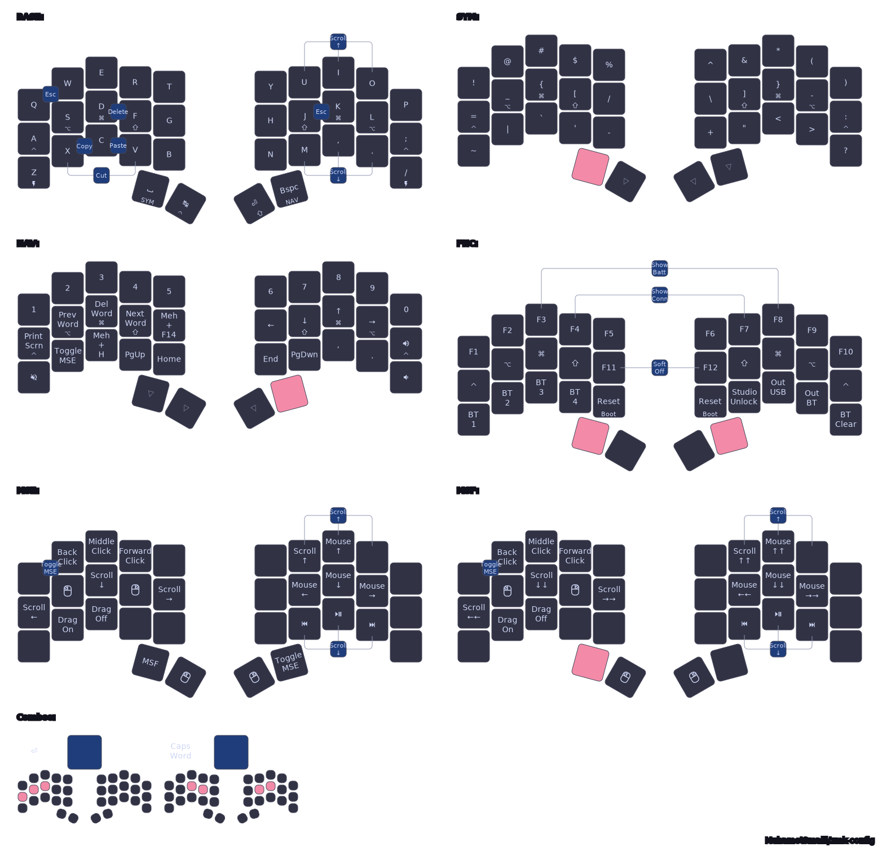

# 34-Key Layout using ZMK

| [🦀 Ferris Sweep](https://github.com/davidphilipbarr/Sweep)                                                                               | [🪸 Urchin](https://github.com/duckyb/urchin)                                                                                        | [Forager](https://github.com/carrefinho/forager)                                                                                               |
| ----------------------------------------------------------------------------------------------------------------------------------------- | ------------------------------------------------------------------------------------------------------------------------------------ | ---------------------------------------------------------------------------------------------------------------------------------------------- |
|  |  |  |

This is my personal [ZMK](https://zmk.dev/) keymap shared across three different 34-key keyboards. It’s drawn using [keymap-drawer](https://github.com/caksoylar/keymap-drawer) and includes configurations for both dongle-based and dongleless setups.

## Firmware Builds

Keyboards support two connection styles:

### Dongle Setup

- `<keyboard_name>_dongle` → Flash to the dongle
- `<keyboard_name>_left_peripheral` → Flash to the left half
- `<keyboard_name>_right` → Flash to the right half

### Dongleless Setup

- `<keyboard_name>_left_central` → Flash to the left half (acting as central)
- `<keyboard_name>_right` → Flash to the right half

## Local Docker Tooling

You can validate keymap changes locally if you have docker.

- Use `make` for local build/draw:

  ```sh
  make help

  make build KEYBOARD=urchin
  make build KEYBOARD=urchin DONGLE=1
  make build KEYBOARD=forager

  make draw KEYBOARD=urchin
  make draw KEYBOARD=forager
  make draw-all
  ```

  Local builds read `build.yaml` directly so board/shield/snippet/cmake settings stay aligned with CI.

  Output files are written under:
  - `build/local/<keyboard>_left_peripheral.uf2`
  - `build/local/<keyboard>_right.uf2`
  - `build/local/<keyboard>_left_central.uf2` (default) or `build/local/<keyboard>_dongle.uf2` (`DONGLE=1`)

  Keymap outputs are written under `tools/keymap-drawer/`.
  The first run builds a pinned local Docker image for keymap-drawer.

- Prerequisite: Docker deamon must be running.

---

## Layout Philosophy

- The layout loosely follows QWERTY conventions; for example, the top row still houses numbers and common symbols.
- With only 34 keys, space is tight. I prioritize frequently used characters and modifiers close to the home row and thumbs (e.g., `[]{}_-|:`, space, backspace, control, tab).
- Combos are used sparingly and intentionally to avoid accidental activations.

---

## Key Features

- **Home-row mods** inspired by [urob’s timeless layout](https://github.com/urob/zmk-config)
  - Tuned **hold-tap behavior** for reliable mod/tap distinction
- **Combos** for essentials like:
  - Enter, Escape
  - Cut / Copy / Paste
  - Fast scrolling (`UIO` / `M,.`)
- **Multi-layer design**:
  - `BASE`: Standard QWERTY with mod-taps
  - `SYMBOL`: Symbols and punctuation (top-row behavior)
  - `NAVIGATION_NUMBER`: Vim-style navigation and number row
  - `MSE`: Mouse keys with drag lock and a fast hold layer (`MSE_FAST`)
  - `FUNC`: Function keys, Bluetooth, keeb settings

---

## Layer Map

<p align="center">

</p>

---

## Credits

- [urob/zmk-config](https://github.com/urob/zmk-config) — for home-row mod philosophy and layout ideas
- [caksoylar/zmk-config](https://github.com/caksoylar/zmk-config) — for layout structure, code inspiration, and keymap-drawer integration
